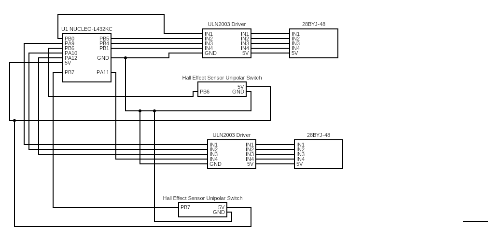
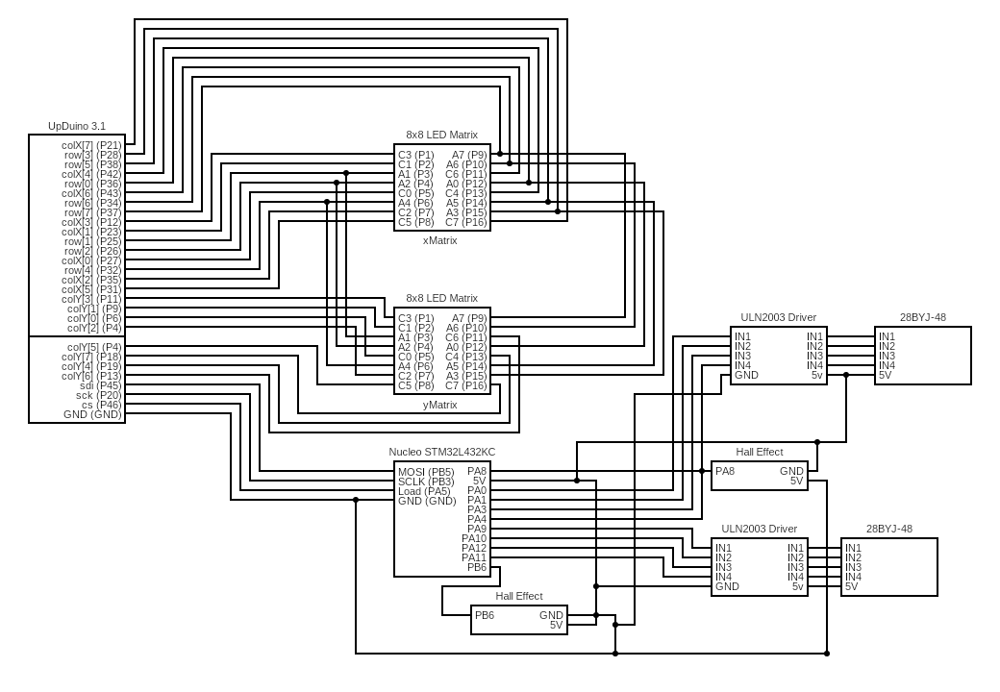

# MCU Design
We use the MCU to control the following main operations:
* Countup timer
* Control the 12V 28BYJ-48 Stepper Motor, which in turns controls how much the flap moves
* Read from the Hall Effect Sensors
* Communicate with FPGA about the local time 

We instantiate one of the MCU’s general purpose timers (TIM15) to initialize a count up timer. We keep track of how many seconds, hours, and minutes have elapsed from the start time, which is manually inputted.

We used the GPIO functions (pinMode, and digitalWrite) in the header file, STM32L432KC_TIM.c, to enable 4 output pins for each of the 4 stepper motors.

We use the digitalRead() GPIO function to determine the home state of one split flap display. In our design, we made the flap labeled “0” our home state. That way, if we wanted to calibrate our flap, we could use the hall effect sensor to get back to a known state.

Lastly, we send the current time to the FPGA, which will then display an emoji (either the sun or moon) on an LED display.**Note that we used two MCU’s: one to control the two hour flaps and send time to the FPGA and the second to control the two minute flaps.** 

## MCU Schematic
MCU 1 Schematic: 

MCU 2 Schematic:

# FPGA Design
  
  The FPGA was used to control the LED display that depicts an emoji of a sun and/or moon based on the time of day. The LED display is made up of two 8x8 LED matrices that are put side to side, making the complete LED display 16x8. Although the FPGA did not have enough pins to fully control two LED matrices, we were able to control two LED matrices with one FPGA by using a time-multiplexing scheme to drive both LED matrices’ anodes, which saved us 8 pins. The FPGA gets its input from the MCU through SPI communication, with the FPGA exclusively reading in the values given from the MCU. This input is 8 bits and the FPGA decodes it to determine what emoji to draw, as well as deciding between two modes, static and scrolling. \

  When scrolling mode is enabled, the FPGA creates a sun or moon emoji on the LED display based on whether it’s day or night respectively, and will be constantly moving left to right in the display. When static mode is enabled the FPGA creates a sun and/or moon emoji on the LED display at a certain position depending on the current time, with each individual emoji and position corresponding to a 45 minute interval of time. As time goes on, the emoji will move left to right every 45 minutes, with emojis changing whenever they leave the display as the new one will enter on the other side. 

## FPGA Block Diagram
