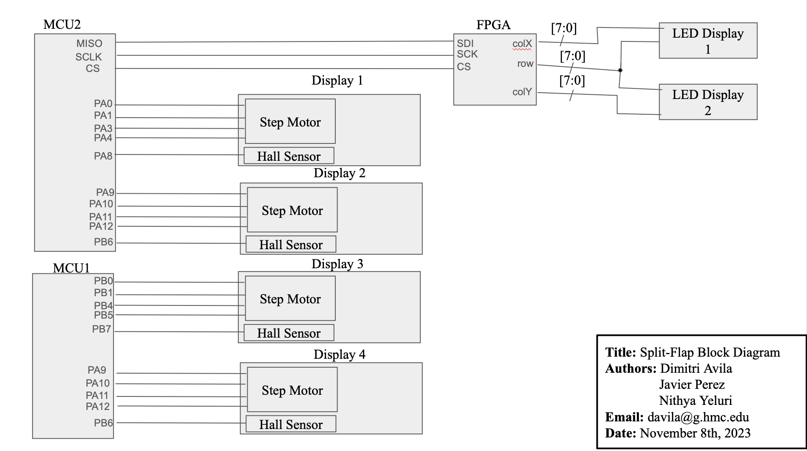

# Project Abstract

Our project aimed to design and implement a distinctive split flap display clock featuring four flap units to showcase the current
time in a 24-hour format (military time). The display configuration, structured as "hour hour : minute minute," provided an intuitive
and visually engaging representation of the current time. The heart of the clock's movement was a precise stepper motor, allowing for
controlled and accurate transitions between time intervals.

In addition to timekeeping, our project incorporated an LED display. This auxiliary feature dynamically displays a sun and moon
emoji, offering an at-a-glance indication of the current time of day. The synchronization between the split flap display and the LED
indicator was facilitated by SPI communication of the current time from our microcontroller to the FPGA which decoded the signal to 
enable the proper LEDs for the time of day.

  

# Project Result (with Video)
**Real-Time Clock with Split Flaps:**
One of the primary goals of our project was to create a real-time clock utilizing split flaps. We are pleased to report that this
objective has been successfully achieved. The clock displays the current time in a 24-hour format using four split flap units in the
arrangement "hour hour minute minute".  However, due to our implementation, the time gets off by around 5 seconds every 10 minutes.
This causes the clock to become less and less accurate as time goes on. A future fix to easily fix this problem would be to use
interrupts so delays needed to spin the flaps don’t affect the timer. Right now, the time it takes for a flap to spin to a number is
the amount offset the clock becomes. 

**LED Display Controlled by FPGA:**
Our project successfully implemented an LED display that dynamically updates a sun or moon emoji depending on the time. This LED
display is controlled by a single FPGA that is synchronized with the current time generated by the MCU via SPI communication. The
successful implementation of FPGA control for the LED display was a key accomplishment for the completion of this project.

**Summary:**
In the end, we were able to make a reasonably accurate clock (for a 24 hour period) accompanied with an LED display to show the time of day via a sun or moon emoji. The reason we say reasonably accurate is because the clock becomes ~12 minutes off after a 24 hour period, so it would ideally be reset each day/ after a few hours for optimal performance. Again, we could fix this by using interrupts with our timer, but this would be a future improvement. The split flaps came out nicely and looked visually appealing; they also make a great tactile sound! A huge thanks to [Dave Madison](https://www.partsnotincluded.com/building-diy-split-flap-displays/) for the outline on how to construct the flaps and laser cutting resources.

# New Hardware
* **Stepper Motor:** One piece of new hardware we hadn’t used before were stepper motors. Unlike traditional motors, a stepper motor allows for precise control over angular displacement, making it an ideal choice for the movements needed in rotating the flaps of the clock. The stepper motor divides a full rotation into a series of steps, and each step corresponds to a specific angular displacement. This level of control ensures accurate positioning of the flaps, contributing to the overall precision and reliability of the clock's rotation amounts.
  
* **Hall Effect Sensors:** In order to synchronize the stepper motor with the physical position of the flaps, we introduced a Hall effect sensor. When the flap spool containing the magnet reaches the designated home position, the Hall effect sensor registers the magnetic field, signaling that the flaps are in their home state. This serves as a pivotal reference point for the system, allowing it to recalibrate and ensure accurate timekeeping. Essentially, the Hall effect sensor acts as a positional marker, providing feedback to the control system about the current state of the flaps. This information is instrumental in maintaining synchronization and preventing drift in the display over time.

# System Block Diagram
This is the block diagram of our entire system: 

